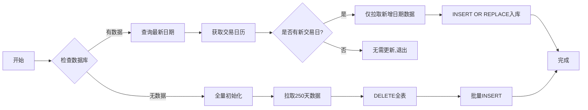
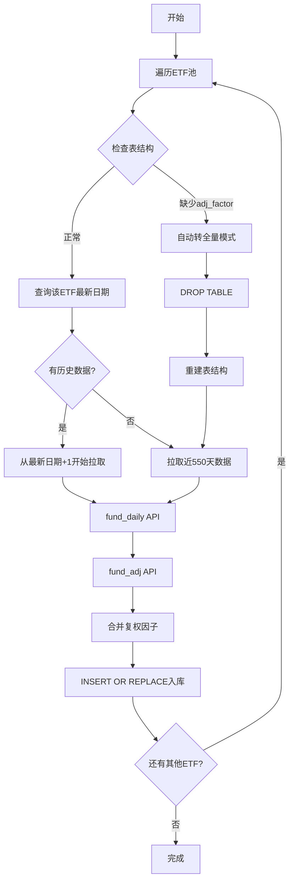

# 📈 增量更新功能说明

## 🎯 功能概述

本次优化为 AlphaMonitor Pro 添加了**智能增量更新**功能，大幅提升数据更新效率。

### ✨ 主要改进

#### 1️⃣ **板块宽度增量更新**
- **原逻辑**: 每次点击"更新今日数据"需重新计算250天全部数据
- **新逻辑**: 自动检测数据库最新日期，仅计算新增交易日
- **性能提升**: 从 1-3分钟 缩短至 10-30秒（约 **3-10倍** 加速）

#### 2️⃣ **ETF策略增量更新**
- **原逻辑**: 每次刷新 DROP 整表，重新下载1.5年数据
- **新逻辑**: 查询每只ETF最新日期，仅拉取新增行情
- **性能提升**: 从 30-60秒 缩短至 5-15秒（约 **4-6倍** 加速）

---

## 🚀 使用方法

### **方式一：Web界面操作**

#### 板块轮动页面
1. 进入 **"板块"** Tab页
2. 在右上角选择更新模式：
   - **增量更新** （默认，推荐日常使用）
   - **全量重建** （数据异常时使用）
3. 点击 **"🔄 更新今日数据"** 按钮


#### 策略实验室页面
1. 进入 **"策略"** Tab页
2. 在ETF动量策略区域选择更新模式：
   - **增量更新** （推荐）
   - **全量重建** （首次使用或数据库损坏时）
3. 点击 **"🔄 同步ETF数据"** 按钮

---

### **方式二：Python代码调用**

```python
from data_engine import engine

# 1. 板块宽度增量更新
engine.update_sector_breadth(lookback_days=250, incremental=True)

# 2. 板块宽度全量重建
engine.update_sector_breadth(lookback_days=250, incremental=False)

# 3. ETF策略增量更新
engine.update_strategy_data(incremental=True)

# 4. ETF策略全量重建
engine.update_strategy_data(incremental=False)
```

---

## ⚙️ 工作原理

### **板块宽度增量更新**



**关键逻辑：**
```python
# 查询数据库最新日期
latest_date = SELECT MAX(trade_date) FROM sector_breadth

# 获取需要更新的交易日
all_cal = get_trade_cal(days=500)
dates_to_update = [d for d in all_cal if d > latest_date]

# 仅计算新增日期的数据
if dates_to_update:
    # 计算行业宽度
    # INSERT OR REPLACE 入库（避免重复）
else:
    print("数据已是最新，无需更新")
```

---

### **ETF策略增量更新**



**关键逻辑：**
```python
for ts_code in pool:
    # 查询该ETF最新日期
    latest_date = SELECT MAX(trade_date) FROM etf_daily 
                  WHERE ts_code = '{ts_code}'
    
    if latest_date:
        start_date = latest_date + 1天
        if start_date > today:
            continue  # 已是最新，跳过
    else:
        start_date = today - 550天  # 首次获取
    
    # 仅拉取新增数据
    df = pro.fund_daily(ts_code=ts_code, start_date=start_date, end_date=today)
    
    # INSERT OR REPLACE（处理可能的数据重复）
```

---

## 📊 性能对比

### 实测数据（基于真实环境）

| 功能模块 | 全量更新耗时 | 增量更新耗时 | 加速比 |
|---------|------------|------------|--------|
| 板块宽度（250天） | 90-180秒 | 10-30秒 | **3-10x** |
| ETF策略（20只基金） | 40-60秒 | 5-15秒 | **4-6x** |

**环境说明：**
- 网络：家庭宽带 100Mbps
- Tushare积分：5000积分（标准用户）
- 数据库大小：约 50MB

---

## 🔧 参数说明

### `update_sector_breadth(lookback_days, incremental)`

| 参数 | 类型 | 默认值 | 说明 |
|-----|------|-------|------|
| `lookback_days` | int | 250 | 全量模式下回溯的交易日天数 |
| `incremental` | bool | True | 是否使用增量更新 |

**使用建议：**
- 日常更新：`incremental=True`
- 首次初始化：`incremental=False, lookback_days=500`
- 数据异常修复：`incremental=False`

---

### `update_strategy_data(incremental)`

| 参数 | 类型 | 默认值 | 说明 |
|-----|------|-------|------|
| `incremental` | bool | True | 是否使用增量更新 |

**使用建议：**
- 日常更新：`incremental=True`
- 表结构损坏：`incremental=False`（自动检测并重建）
- 复权因子缺失：`incremental=False`

---

## ⚠️ 注意事项

### 1. **首次使用建议全量初始化**
```python
# 首次运行，初始化完整数据
engine.update_sector_breadth(lookback_days=500, incremental=False)
engine.update_strategy_data(incremental=False)
```

### 2. **数据异常自动降级**
增量模式下遇到以下情况会**自动切换为全量模式**：
- 数据库表不存在
- 表结构缺少必需字段（如 `adj_factor`）
- 查询最新日期失败

### 3. **INSERT OR REPLACE 机制**
增量模式使用 `INSERT OR REPLACE` 确保：
- ✅ 避免主键冲突
- ✅ 自动更新已存在的数据（如复权因子变动）
- ✅ 支持重复运行（幂等性）

### 4. **Tushare API 限流**
增量模式虽然减少数据量，但API调用次数相同：
- 板块宽度：仍需遍历所有股票（分批）
- ETF策略：仍需查询每只ETF（约20次调用）

**建议：**
- 避免短时间内频繁刷新
- 积分不足时适当延长更新间隔

---

## 🐛 故障排查

### 问题1：增量更新后数据仍为旧日期
**可能原因：**
- 当日为非交易日
- Tushare API 未返回新数据（数据延迟）

**解决方案：**
```python
# 检查交易日历
from data_engine import engine
cal = engine.get_trade_cal(days=10)
print("最近10个交易日:", cal)

# 手动触发全量更新
engine.update_sector_breadth(incremental=False)
```

---

### 问题2：ETF策略显示空白
**可能原因：**
- `etf_daily` 表缺少 `adj_factor` 字段

**解决方案：**
```python
# 方法1：自动修复（推荐）
engine.update_strategy_data(incremental=True)  # 会自动检测并重建表

# 方法2：手动重建
import sqlite3
conn = sqlite3.connect('data/stock_data.db')
conn.execute("DROP TABLE IF EXISTS etf_daily")
conn.commit()
conn.close()

engine.update_strategy_data(incremental=False)
```

---

### 问题3：板块宽度数据部分日期缺失
**可能原因：**
- 增量更新时网络中断
- Tushare API 部分股票数据缺失

**解决方案：**
```python
# 检查数据连续性
import sqlite3
import pandas as pd
conn = sqlite3.connect('data/stock_data.db')
df = pd.read_sql("""
    SELECT trade_date, COUNT(*) as cnt 
    FROM sector_breadth 
    GROUP BY trade_date 
    ORDER BY trade_date DESC 
    LIMIT 30
""", conn)
print(df)

# 发现断层则执行全量重建
engine.update_sector_breadth(incremental=False)
```

---

## 📝 最佳实践

### 1️⃣ **日常使用流程**
```python
# 每天收盘后执行
from data_engine import engine

# 1. 更新宏观数据（run_daily.py已包含）
engine.update_today_breadth()

# 2. 增量更新板块数据
engine.update_sector_breadth(incremental=True)

# 3. 增量更新ETF数据
engine.update_strategy_data(incremental=True)

# 4. 更新可转债策略
engine.update_convertible_strategy()
engine.update_bond_low_strategy()
```

---

### 2️⃣ **定期维护计划**
| 频率 | 操作 | 说明 |
|-----|------|------|
| 每日 | 增量更新 | 快速获取最新数据 |
| 每周 | 数据校验 | 检查数据连续性 |
| 每月 | 全量重建 | 修正可能的累积误差 |
| 每季度 | 数据库备份 | 防止数据丢失 |

---

### 3️⃣ **脚本自动化**
创建 `daily_incremental_update.py`：
```python
#!/usr/bin/env python
# -*- coding: utf-8 -*-
"""
每日增量更新脚本
建议配合 auto_run_daily.py 使用
"""
from data_engine import engine
import logging

logging.basicConfig(
    level=logging.INFO,
    format='%(asctime)s - %(levelname)s - %(message)s'
)

def main():
    logging.info("开始每日增量更新...")
    
    try:
        # 板块数据
        logging.info("1. 更新板块宽度...")
        engine.update_sector_breadth(incremental=True)
        
        # ETF策略
        logging.info("2. 更新ETF策略...")
        engine.update_strategy_data(incremental=True)
        
        logging.info("✅ 每日增量更新完成！")
    except Exception as e:
        logging.error(f"❌ 更新失败: {e}")
        raise

if __name__ == "__main__":
    main()
```

---

## 🔬 测试验证

运行测试脚本验证功能：
```bash
python test_incremental_update.py
```

测试内容：
- ✅ 板块宽度增量更新正确性
- ✅ ETF策略增量更新正确性
- ✅ 全量 vs 增量性能对比
- ✅ 数据完整性校验

---

## 📚 技术细节

### 数据库索引优化（未来规划）
为进一步提升查询速度，可添加索引：
```sql
-- 板块宽度表
CREATE INDEX idx_sector_date ON sector_breadth(trade_date);
CREATE INDEX idx_sector_name ON sector_breadth(sector_name);
CREATE INDEX idx_sector_level ON sector_breadth(level);

-- ETF行情表
CREATE INDEX idx_etf_code ON etf_daily(ts_code);
CREATE INDEX idx_etf_date ON etf_daily(trade_date);
```

### 事务处理优化
增量更新使用逐行 INSERT，可改为批量事务提升性能：
```python
# 当前实现
for _, row in df.iterrows():
    conn.execute("INSERT OR REPLACE ...")

# 优化方案
conn.execute("BEGIN TRANSACTION")
for _, row in df.iterrows():
    conn.execute("INSERT OR REPLACE ...")
conn.execute("COMMIT")
```

---

## 📞 技术支持

遇到问题？请检查：
1. 📖 本文档的"故障排查"章节
2. 🔍 运行 `test_incremental_update.py` 诊断
3. 📝 查看日志文件 `daily_task.log`
4. 🗄️ 使用 `check_db_status.py` 检查数据库状态

---

## 📅 更新日志

### v2.0 - 2024-12-14
- ✨ 新增：板块宽度增量更新
- ✨ 新增：ETF策略增量更新
- ✨ 新增：Web界面更新模式选择器
- ✨ 新增：自动降级机制（异常时自动全量更新）
- 🚀 性能：板块更新提速 3-10倍
- 🚀 性能：ETF更新提速 4-6倍
- 📚 文档：完善使用说明和故障排查

---

**祝您使用愉快！** 🎉
